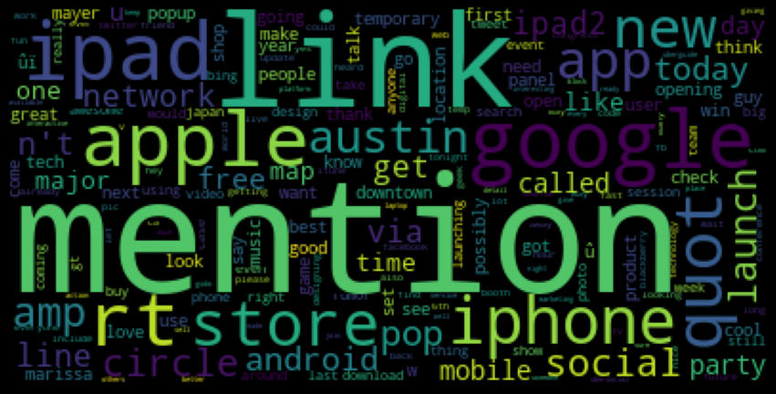
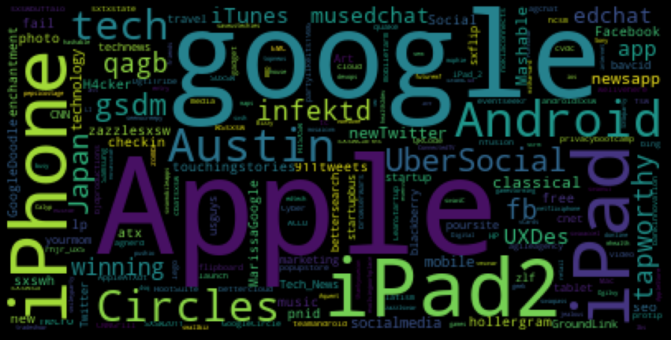
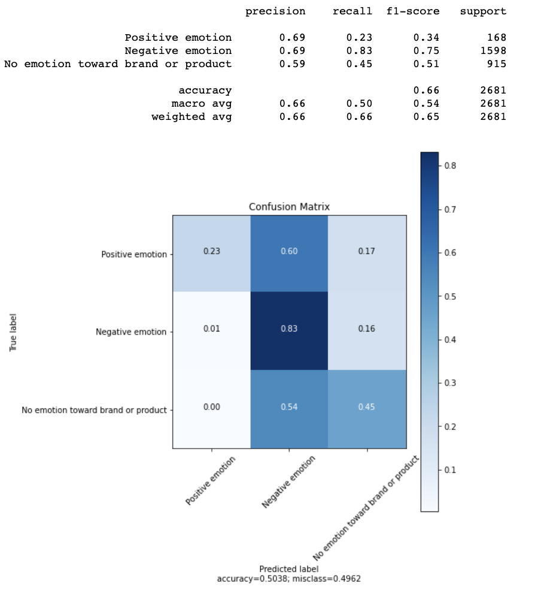
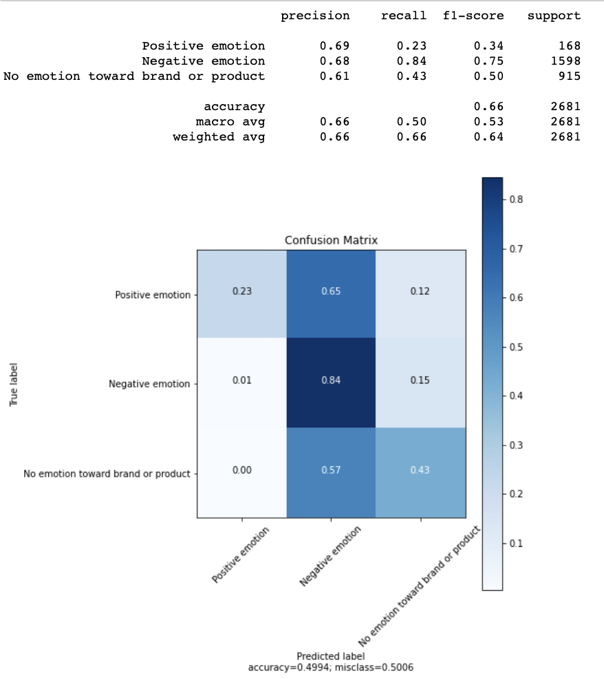
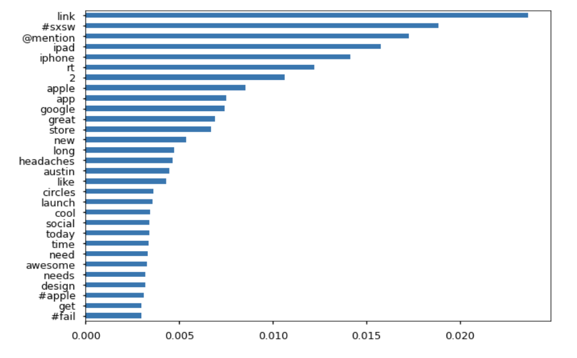
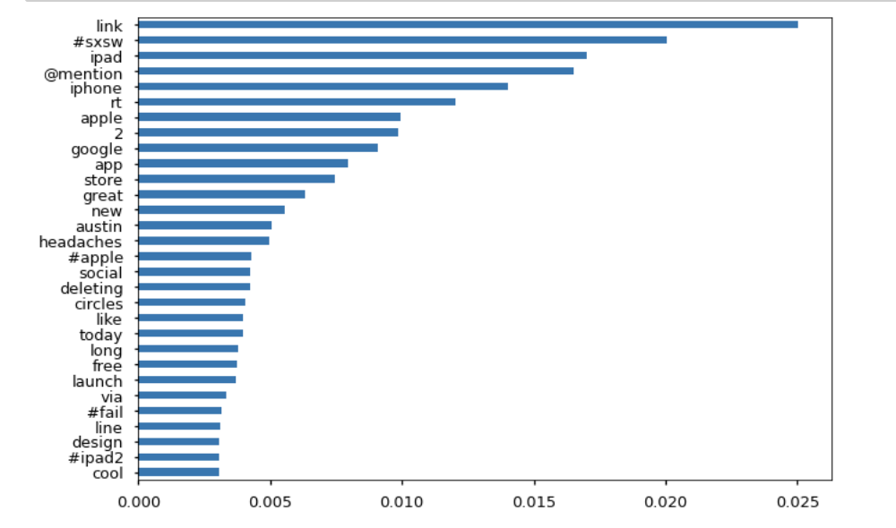
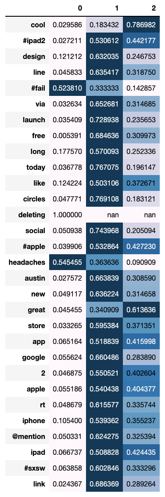

# Module 4 Final Project

## Introduction

In the following notebook we will be uncovering information from a dataset. Particularly, we will be creating a model which explores the likelyhood of a tweet being associated with a specific emotion. To do this we will be walking through two classification models. The data we will be reviewing provides us with tweets and an emotional responses towards those tweets. What we explore throughout this notebook will help us further understand the words that are associated most commonly with an emotion. We also need to understand their importance / frequency. E.g. Does 'incredible' associate more with negative, positive or neutral emotions. The models will be most helpful for organizations looking to more easily digest consumer feedback when it comes to negative tweets.

## The Dataset (Obtaining the data)

For this project, I'll be working with a telecommunication dataset. This dataset holds information on over 3.3k clients and informs us on whether or not they churn. The dataset is made up of the following columns:
* tweet_text
* emotion_in_tweet_is_directed_at
* is_there_an_emotion_directed_at_a_brand_or_product

## Cleaning Data (Scrub)
I needed to view the data to make sure there were no null values, random strings and outliers that would impact our information negatively. To do this I needed to:
* Remove any unnecessary columns that didn't fit what we were solving for (product).
* Checked for Null values and remove the rows in its entirety.
* Renaming my columns to be more digestable
* Dealing with stopwords
* Seperated my columns into X and y dataframes.
* X was my tweets and y was my target (emotion).
* Since churn was in boolean I then converted it to an integer.

## Exploring Data
I wanted to get an understanding of some of the correlations occuring post cleaning my data. I went through and created a few different function that understood how to read tweets given the symbols tweets carry (e.g. @, #, etc.). I created a few wordclouds that helped show me some patterns in the tweets themselves. Some of the things I explored were common words, hashtags, mentions and links. The ones that had more of a takeaway came from the hashtags and common words. The data did not provide all the links and didn't tell us who was frequently '@mentioned' due to privacy restrictions, making this data not important / less meaningful.

### Most frequently used words

### Most Frequently used hashtags

## Modeling Data
Finally I needed to model my data. What was most important to me and for any client will be the recall of negative emotions. We needed to first make sure we had a relatively accurate model. Recall expresses the ability to find all relevant instances in a dataset so this needed to be as close to 1 as we could get. Again we wanted to favor the model towards negative emotions.

I chose to use 2 models. Random Forests and Gridsearch. As we explore the data we will find which model performed the best in regards to (negative emotion) recall. We want to make sure we are more sensitive when it comes to negative emotions.

Random Forests

GridSearchCV

Another key element was taking a look at which words appeared most frequently, something we also address as its importance in the data set which are provided below.

### Feature Importance (Random Forest)

### Feature Importance (GridSearchCV)

### Top 30 Words Associated with Emotion
Finally we built further onto the model to explore what words were associate with each emotion. Below is a key to help distinguish the dataframe you see below.

Negative Emotion: 0 
Neutral Emotion: 1
Positive Emotion: 2

## Conclusion

Following the exploration of the dataset we can conclude on a few things. That our model performed well and it performed well when it came to the recall of negative emotions. Which in this instance we want to be more sensitive towards. It speaks to itself, but a company would rather hear more about negative comments than positive so they can improve their business.

There are some obvious words that associate with negative emotion, like 'sucks' but the runner ups were words like 'design'. From a client perspective, you'd want to dig more into the underlying problems with design and maybe single out tweets that included design and were negative. This way a business can tweak where things went wrong for the consumer.

We can recommend to anyone looking to leverage a model like the above is to exlore the patterns you normally see with your consumer base. Is it always positive, is it always negative or is it neutral. From here you can really slice and dice the model the perform in a way that would allow you to take a deeper dive into your consumer base. For the context of this model it will help pull / identify negative tweets for the client.

